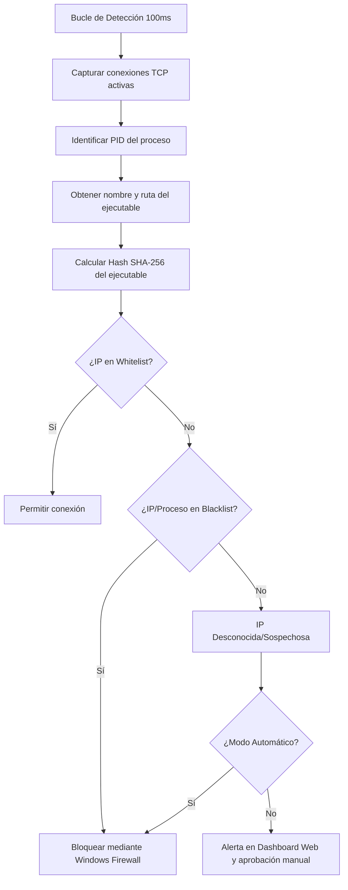

# Wiki del Proyecto: Monitor de Red con IA

Bienvenido a la Wiki oficial de **Prompt Network Monitor con IA**. Este documento detalla la arquitectura del proyecto, el porqué de su desarrollo, un análisis técnico de su funcionamiento y cómo actúa como un escudo crítico contra amenazas modernas de ciberseguridad, como los ataques a la cadena de suministro y la ejecución de infostealers de fuentes desconocidas.

---

## 📖 Índice
1. [¿Por qué se creó este proyecto?](#-por-qué-se-creó-este-proyecto)
2. [¿Cómo funciona el Monitor de Red?](#-cómo-funciona-el-monitor-de-red)
3. [Prevención de Ataques a la Cadena de Suministro (Supply Chain Attacks)](#-prevención-de-ataques-a-la-cadena-de-suministro-supply-chain-attacks)
4. [Mitigación de Infostealers y Ejecución de Software sin Firmar](#-mitigación-de-infostealers-y-ejecución-de-software-sin-firmar)
5. [Ejemplos y Casos de Referencia](#-ejemplos-y-casos-de-referencia)

---

## 💡 ¿Por qué se creó este proyecto?

En el ecosistema de desarrollo de software actual, los desarrolladores y usuarios finales descargan, instalan y ejecutan diariamente cientos de herramientas, dependencias y aplicaciones. Muchas de estas descargas provienen de fuentes de terceros, repositorios de código abierto o portales de distribución no oficiales. 

Las herramientas tradicionales de seguridad (como los antivirus clásicos basados en firmas estáticas) a menudo no logran detectar software malicioso personalizado de día cero o versiones envenenadas de software legítimo a tiempo. 

Este monitor de red se creó para proporcionar una **línea de defensa activa en el endpoint (estilo NDR/EDR liviano)**. Su propósito es interceptar conexiones de red a nivel de socket en milisegundos y permitir a los usuarios avanzados tener un control total sobre qué procesos de su máquina intentan establecer comunicación hacia el exterior, previniendo la fuga de información sensible.

---

## 🛠️ ¿Cómo funciona el Monitor de Red?

El monitor está desarrollado en **Go** para lograr un alto rendimiento con un bajo consumo de recursos en entornos Windows. Funciona mediante un bucle de detección continua que consta de las siguientes fases:

### Componentes Técnicos Clave:
1. **Captura de Red (`GetTCPConnections`)**: Consulta el estado de la tabla de conexiones TCP en Windows para obtener la IP remota y el PID asociado.
2. **Identificación de Procesos (`GetProcessPath` y `GetProcessName`)**: Resuelve la ruta física del archivo ejecutable mediante llamadas a la API de Windows, WMI y comandos de PowerShell como fallbacks robustos.
3. **Cálculo de Integridad (`GetProcessHash`)**: Genera el hash SHA-256 en tiempo real del archivo en ejecución para verificar si ha sido modificado o alterado.
4. **Geolocalización con Caché (`GeoLocator`)**: Consulta la ubicación geográfica de las IPs remotas de destino mediante APIs de geolocalización, almacenando las respuestas en caché local para no penalizar el rendimiento del sistema.
5. **Acción del Firewall de Windows (`Firewall.Block`)**: Si se determina que la conexión debe ser bloqueada, el monitor ejecuta reglas dinámicas del Firewall de Windows para interrumpir el tráfico saliente de inmediato.

---

## ⛓️ Prevención de Ataques a la Cadena de Suministro (Supply Chain Attacks)

Un **ataque a la cadena de suministro** ocurre cuando un actor malicioso infiltra código dañino en un componente, servicio o software legítimo del cual dependen otras organizaciones o usuarios. 

### ¿Cómo ayuda este Monitor?
Incluso si un atacante logra comprometer una librería legítima de código abierto (por ejemplo, a través de NPM) o secuestra el mecanismo de actualización de un programa de confianza, el malware infiltrado **tarde o temprano requerirá conectarse a Internet** para:
* Descargar malware de segunda etapa (payloads).
* Recibir instrucciones de un servidor de Comando y Control (C2).
* Enviar la información recolectada del sistema víctima.

Al interceptar todas las conexiones salientes a nivel del sistema operativo, el monitor de red detectará que un proceso legítimo está intentando conectarse a un host desconocido o sospechoso (fuera de la lista blanca). Al bloquear esa conexión de inmediato (en modo automático) o alertar al usuario en el Dashboard (en modo manual), **se rompe la cadena del ataque**, imposibilitando que el atacante controle la máquina o extraiga los datos.

---

## 🥷 Mitigación de Infostealers y Ejecución de Software sin Firmar

Es común descargar utilidades, scripts de automatización o instaladores de fuentes desconocidas y que carecen de firma digital. Esto expone al sistema a amenazas críticas como los **Infostealers**.

### El Peligro de los Infostealers:
Un infostealer está diseñado para ser rápido. Tan pronto como el usuario lo ejecuta, el malware:
1. Extrae credenciales guardadas en navegadores (Google Chrome, Edge, etc.).
2. Roba cookies de sesión y tokens de plataformas (Discord, Telegram).
3. Busca claves privadas y archivos de carteras (wallets) de criptomonedas.
4. Intenta exfiltrar este paquete de datos en cuestión de segundos.

### La Solución del Monitor:
Dado que el monitor opera con una frecuencia de detección muy rápida (configurable de 100ms a 1s), en el momento exacto en que el ejecutable malicioso intenta abrir una conexión TCP para transmitir la información robada, el monitor intercepta la conexión. 

Al tratarse de una IP destino totalmente nueva y un proceso desconocido (cuyo hash no está registrado ni en la whitelist), **la conexión es bloqueada al instante**, evitando que la información robada salga de tu máquina, neutralizando el impacto del infostealer por completo.

---

## 🔗 Ejemplos y Casos de Referencia

Para comprender mejor estas amenazas y cómo opera la industria de la seguridad ante ellas, consulta las siguientes coberturas de incidentes en *BleepingComputer*:

*   **Ataques a la cadena de suministro generales**: Conoce las últimas tendencias de cómo los atacantes dirigen sus esfuerzos a proveedores y canales de distribución.
    *   [BleepingComputer: Supply Chain (General)](https://www.bleepingcomputer.com/tag/supply-chain/)
    *   [BleepingComputer: Supply Chain Attack (Noticias y Análisis)](https://www.bleepingcomputer.com/tag/supply-chain-attack/)
*   **Envenenamiento de paquetes en repositorios (NPM)**: Ejemplos de cómo los desarrolladores de Javascript son atacados introduciendo malware en librerías comunes de Node.js.
    *   [BleepingComputer: NPM Ecosystem Security](https://www.bleepingcomputer.com/tag/npm/)
*   **Secuestro de actualizaciones de software confiable (El caso de Notepad++)**: Una campaña sofisticada donde piratas informáticos estatales chinos lograron secuestrar la función de actualización de Notepad++ durante meses para distribuir troyanos a los usuarios que actualizaban la app.
    *   [BleepingComputer: Notepad++ Update Hijacked Case](https://www.bleepingcomputer.com/news/security/notepad-plus-plus-update-feature-hijacked-by-chinese-state-hackers-for-months/)

Con **Prompt Network Monitor con IA**, si una aplicación como Notepad++ intentase descargar una actualización maliciosa desde un dominio comprometido, el monitor detectaría la conexión anómala y la bloquearía antes de que pudiera completar la descarga del troyano.

---

*Nota: La seguridad de tu sistema depende de mantener tus listas de control (`whitelist.txt` y `blacklist.txt`) revisadas y actualizadas regularmente.*
